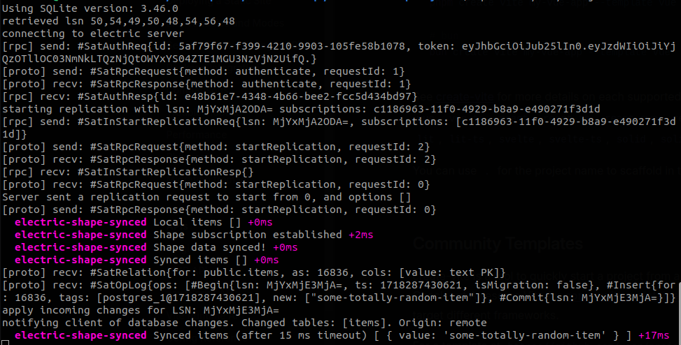
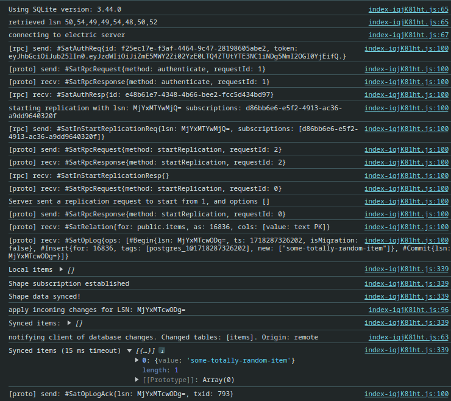

# electric-shape-synced
This is an example to debug the [promise workflow](https://electric-sql.com/docs/usage/data-access/shapes#promise-workflow) of [ElectricSQL](https://github.com/electric-sql/electric/) shapes, in particular `shape.synced`.

## Documented behavior

According to the [docs](https://electric-sql.com/docs/usage/data-access/shapes#promise-workflow), the data should be available in the local DB after `shape.synced` resolves.
```javascript
// Resolves once the shape subscription
// is confirmed by the server.
const shape = await db.projects.sync()

// Resolves once the initial data load
// for the shape is complete.
await shape.synced
```

## Unexpected result

It looks like after `shape.synced` resolves, there still is some delay before the data is actually available in the local DB:

```javascript
const shape = await db.items.sync()
await shape.synced

const syncedItems = await db.items.findMany()
console.log('Synced items', syncedItems) // Gives me []

// However, if I wait an arbitrary amount of time...
setTimeout(async () => {
  const syncedItems = await db.items.findMany()
  console.log(`Synced items (timeout)`, syncedItems) // Gives me ['...', (...)]
}, 15)
```

## Why does it matter

It's probably not a big deal for apps running in the browser. Assuming you are using live queries w/ reactivity, your data would still show up eventually.

However in **Node.js**, let's say I want to start my server component / accept API requests only after my data is fully loaded in the local DB.  
It's difficult to estimate the amount of time I should wait after the promise resolution.  
It might change depending on dataset size, host specs and so on. Plus, it kind of defeats the purpose of awaiting the promise resolution.


## How to reproduce
You can reproduce both in Node and React, just make sure to :warning: **wipe your PG DB before testing**, for consistency.

### Install dependencies
```sh
git clone git@github.com:Gobbo89/electric-shape-synced.git
cd electric-shape-synced
npm install
# Adjust the .env file to your likings
```
### Node.js
Using some basic sample [code for Node](./src/nodejs.ts). Steps to reproduce:
```sh
#### If needed, wipe everything first
npm run backend:down
# Download, install, start Docker cnts, vlms, ecc.
npm run backend:start
npm run db:migrate
npm run client:generate
####

# Run the node example for the first time
npx tsx ./src/nodejs.ts
# A new DB file will be created.
# Now exit Node with Ctrl+C

npm run db:psql
> insert into items values ('some-totally-random-item');
> \q

npx tsx ./src/nodejs.ts
# Check the logs:
```


### React.js
For React I used the template provided by `create-electric-app`, w/ some additions in [Example.tsx](./src/Example.tsx). Steps to reproduce:
```sh
#### If needed, wipe everything first
npm run backend:down
# Download, install, start Docker cnts, vlms, ecc.
npm run backend:start
npm run db:migrate
npm run client:generate
####

# We want to build in order to remove React.StrictMode
# In fact, StrictMode would influence the test
npm run build
npm run preview

# ❗IMPORTANT❗
#  Open the Vite preview URL in your browser,
#  this will initialize the browser DB.

# ❗IMPORTANT❗
#  Now, do NOT close the Vite preview browser tab!
#  Instead, just navigate to "about:blank" in the same tab.
#  That's because we do not want the session
#  storage for electric_sub & tab:id to change.

npm run db:psql
> insert into items values ('some-totally-random-item');

# Now, in the SAME browser tab, open the Dev console.
# ❗IMPORTANT❗
# Do NOT use the back button.
# In the SAME browser tab navigate from "about:blank"
# to the Vite preview URL. Check the Dev console logs:
```
